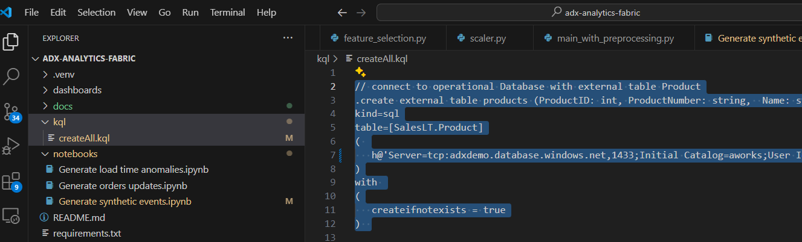
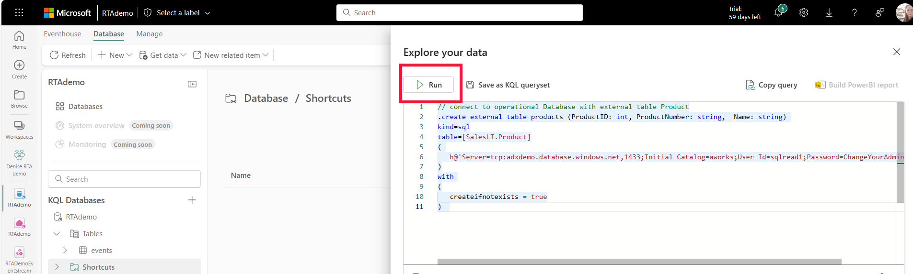
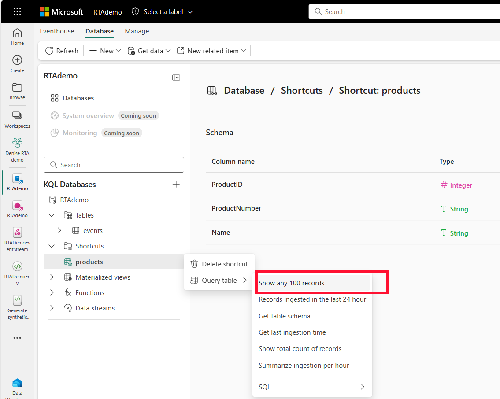

# Introduction
Suppose you own an e-commerce website selling bike accessories.  
You have millions of visitors a month, you want to analyze the website traffic, consumer patterns and predict sales.  
This workshop will walk you through the process of building an end-to-end Real time Analytics Solution in MS Fabric, using the medallion architecture, for your e-commerce website.  

You will learn how to:
* Build a medallion architecture in MS Fabric Real time analytics
* Use Fabric data pipelines for copying data from an operational DB (SQL server with Adventure works sample data)
* Stream events and ingest them into MS Fabric RTA (Real time analytics) using EventStream
* Create data transformations in Fabric RTA (Real time analytics)
* Create reports for real time visualizations using RTA (Real time analytics) dashboards

All the code in this tutorial can be found here:   
[ADX Analytics github repo](<https://github.com/denisa-ms/adx-analytics-fabric>)  

Built by:   
**Denise Schlesinger**   
**Principal Cloud Solution Architect @Microsoft**   
[Linkedin](<https://www.linkedin.com/in/deniseschlesinger/>)     
[Github](<https://github.com/denisa-ms>)

---

# What is the Medallion Architecture?
A medallion architecture (also coined by Databricks) is a data design pattern used to logically organize data.
The goal is to incrementally improve the structure and quality of data as it flows through each layer of the architecture.
Medallion architectures are sometimes also referred to as "multi-hop" architectures.

Creating a multi layer data platform allow companies to improve data quality across the layers and at the same time provide for their business needs.
Unstructured and raw data are ingested using scalable pipelines to output the highest quality enriched data.
It contains 3 basic layers.

## Bronze layer
- Contains raw data, sometimes referenced as the data staging area.  
- Not accessible to consumers only to engineers.  
- May contain data with PII (personal identifiable information).  

## Silver layer
- Contains deduplicated, enriched data.  
- Accessible to all consumers.  
- Contains “anonymized data” (no PII).  
- Consumers: Data analysts, Data scientists, Engineers.  

## Gold layer
- Contains aggregated data.  
- Accessible to all consumers.  
- Built for dashboards.

---

# Fabric Real time analytics features 

## Event streams
* [Event streams](<https://learn.microsoft.com/en-us/fabric/real-time-analytics/event-streams/overview>)   
  Clicks and Impressions events are ingested from an Eventstream into the "Event" table

## Data pipelines
* [Data pipelines](<https://learn.microsoft.com/en-us/fabric/data-factory/tutorial-end-to-end-pipeline>)  
  Bronze layer tables are populated by an MS Fabric Data pipeline copying data from our operational SQL DB 

## Shortcuts
* [Shortcuts](<https://learn.microsoft.com/en-us/fabric/real-time-analytics/onelake-shortcuts?tabs=onelake-shortcut>) 
  Product and ProductCategory tables are defined as external tables (fabric shortcuts) hosted in our operational SQL DB.  
  Meaning the data is not copied but served from the SQL DB itself.  

  Shortcuts enable us to create live connections between OneLake and existing target data sources, whether internal or external to Azure. This allows us to retrieve data from these locations as if they were seamlessly integrated into Microsoft Fabric.  
  A shortcut is a schema entity that references data stored external to a KQL database in your cluster.  
  In Lakehouses and Kusto Query Language (KQL) databases, it's possible to create shortcuts referencing Internal locations within Microsoft Fabric, ADLS Gen2, Spark Notebooks, AWS S3 storage accounts, or Microsoft Dataverse. From my perspective, I value the fact that all data is aligned under a unified namespace, allowing seamless access through the same ADLS Gen2 APIs, even when sourced from AWS S3.
  By enabling us to reference different storage locations, OneLake's Shortcuts provides a unified source of truth for all our data within the Microsoft Fabric environment and ensures clarity regarding the origin of our data.  

## KQL DB - Update policies  
* [KQL DB - Update policies](<https://learn.microsoft.com/en-us/azure/data-explorer/kusto/management/update-policy>)    
  Update policies are automation mechanisms triggered when new data is written to a table. They eliminate the need for special orchestration by running a query to transform the ingested data and save the result to a destination table. Multiple update policies can be defined on a single table, allowing for different transformations and saving data to multiple tables simultaneously. The target tables can have a different schema, retention policy, and other policies from the source table.  
  The silver layer tables in our medallion architecture will be created upon ingestion, based on Kusto's update policies feature,  allowing to append rows to a target table by applying transformations to a source table.  

## KQL DB - Materialized views  
* [KQL DB - Materialized views](<https://learn.microsoft.com/en-us/azure/data-explorer/kusto/management/materialized-views/materialized-view-overview>)   
  Materialized views expose an aggregation query over a source table, or over another materialized view.  
  We will use materialized views to create the Gold Layer in our medallion architecture.  

## KQL DB - One logical copy  
* [KQL DB - One logical copy](<https://learn.microsoft.com/en-us/fabric/real-time-analytics/one-logical-copy>) 
When activated, it will constantly copy the KQL data to your Fabric Datalake in delta format. Allowing you to query the data in your KQL database in Delta Lake format using Spark or SQL endpoint on the Lakehouse.

## KQL DB dynamic fields  
* [KQL DB - Dynamic fields](<https://learn.microsoft.com/en-us/azure/data-explorer/kusto/query/scalar-data-types/dynamic>)
Dynamic fields are a powerful feature of Eventhouse/ KQL DB that supports evolving schema changes and object polimorphism, allowing to store different event types that have a common denominator of base fields

---

# The e-commerce store   

The e-commerce store database entities are:  
* Product: the product catalog. 
* ProductCategory: the product categories.  
* Customer: the customers that purchased items in the store.
* Address: the addresses of the customers.
* SalesOrderHeader: the metadata for the orders.
* SalesOrderDetail: every item purchased in an order.
* Event: a click or impression event.   
  - An impression event is logged when a product appears in the search results.
  
  - A click event is logged when the product is clicked and the customer has viewed the details.  
  

Photo by <a href="https://unsplash.com/@himiwaybikes?utm_content=creditCopyText&utm_medium=referral&utm_source=unsplash">Himiway Bikes</a> on <a href="https://unsplash.com/photos/black-and-gray-motorcycle-parked-beside-brown-wall-Gj5PXw1kM6U?utm_content=creditCopyText&utm_medium=referral&utm_source=unsplash">Unsplash</a>  
Photo by <a href="https://unsplash.com/@headaccessories?utm_content=creditCopyText&utm_medium=referral&utm_source=unsplash">HEAD Accessories</a> on <a href="https://unsplash.com/photos/silver-and-orange-head-lamp-9uISZprJdXU?utm_content=creditCopyText&utm_medium=referral&utm_source=unsplash">Unsplash</a>  
Photo by <a href="https://unsplash.com/@jxk?utm_content=creditCopyText&utm_medium=referral&utm_source=unsplash">Jan Kopřiva</a> on <a href="https://unsplash.com/photos/a-close-up-of-a-helmet-with-sunglasses-on-it-CT6AScSsQQM?utm_content=creditCopyText&utm_medium=referral&utm_source=unsplash">Unsplash</a>
  

---

 # Architecture

---

# Data schema

## Data flow
  

## Tables
| Table| Origin     | Description|
|------|------------|------------|
| Customer| Copied using Pipeline| Describes customers and their geographic location|
| Address| Copied using Pipeline|Customers addresses|
| SalesOrderHeader| Copied using Pipeline|Information about sales orders|
| SalesOrderDetail| Copied using Pipeline|Detailed information about sales orders, including product IDs and quantities sold|
| Product|Shortcut to SQL DB|Products, including descriptions and prices|
| ProductCategory|Shortcut to SQL DB|Product category|
| SilverCustomer|EventHouse table|Table created based on an update policy with transformed data|
| SilverAddress|EventHouse table|Table created based on an update policy with transformed data|
| SilverOrdersHeader|EventHouse table|Table created based on an update policy with transformed data|
| SilverOrdersDetail|EventHouse table|Table created based on an update policy with transformed data|
| GoldAddress|EventHouse table|Materialized view showing only the latest changes in the source table showing how to handle duplicate or updated records|
| GoldCustomer|EventHouse table|Materialized view showing only the latest changes in the source table showing how to handle duplicate or updated records|
| GoldSalesOrderHeader|EventHouse table|Materialized view showing only the latest changes in the source table showing how to handle duplicate or updated records|
| GoldSalesOrderDetail|EventHouse table|Materialized view showing only the latest changes in the source table showing how to handle duplicate or updated records|
| Event|EventHouse table|Streaming events representing the product being seen or clicked by the customer. Will be streamed into Fabric Eventhouse from an eventstream. We will push synthetic data (fake data) into an endpoint, using a Fabric Notebook.|

---

# Pre-requisites
* An [Azure Subscription](<https://azure.microsoft.com/en-us/free/>) where you have admin permissions.   
* [Microsoft Fabric](<https://www.microsoft.com/en-us/microsoft-fabric/getting-started>) with admin permissions.   
* [Azure Data Studio](<https://learn.microsoft.com/en-us/azure-data-studio/download-azure-data-studio?view=sql-server-ver16&tabs=win-install%2Cwin-user-install%2Credhat-install%2Cwindows-uninstall%2Credhat-uninstall>)  

---

# Building the Analytics platform
## Fabric Workspace 
Create a Fabric Workspace

## Create a new Eventhouse  
Create an Eventhouse called "RTAdemo"  

## Create a new Eventstream  
Create an Eventhouse called "RTADemoEventStream"  

When we create a "Custom app" as a source, an event hub is created and connected to the EventStream for us.  
Click on the EventStram source - Custom App to get the event hub endpoint and key to send the events from our notebook.  

  

Click on "Sample code" and copy the connectionString to a notepad

Click on "Keys" and copy the event hub name to a notepad

## Import Data Generator Notebook
Import the [Generate synthetic events notebook](<https://github.com/denisa-ms/adx-analytics-fabric/blob/main/notebooks/Generate%20synthetic%20events.ipynb>) to generate events using streaming

Copy the connectionstring and key you pasted into a notepad in the previous step and paste it in the Notebook first code block

## Create an environment 
In order for the compute to run the notebook to have the right libraries, we will create an "environment".
Make sure you are creating an environment with Spark 3.4 (see image below).  
Add the libraries:  
- azure-eventhub  
- faker  
- pyodbc  

## Run the notebook
Open the "generate synthetic events" notebook in your Fabric Workspace.  
Check the python version is "3.10.12.  
Run all the cells in the notebook to start generating streaming events.  

## Define destination in the EventStream
Open the EventStream in your Fabric Workspace.  
Select "New Destination" - KQL Database.  

Select Workspace and the KQL DB we created called "RTADemo"

Create a new table in our KQL DB called "Event".  

You will see a sample of the streaming data showing click and impression events, Click Finish and Close.  

Now, we can see the EventStream destination is in mode "Ingesting".  

## Build the KQL DB schema
Open the RTADemo Eventhouse from your Fabric Workspace.  Click on "Explore your Data".  

Run the KQL scripts to create all the tables.  
Open the  [createAll.kql](<https://github.com/denisa-ms/adx-analytics-fabric/blob/main/kql/createAll.kql>) file and copy the entire file content.  

Paste it in the KQL panel in the KQL DB and run it.  

## Data pipeline
Create Data pipelines to copy the data from the SQL DB tables to our KQL DB.  

## RTA Dashboard
In this step we will create a real time dashboard to visualize the data that looks as follows:  

Create a Data Pipeline that you can run periodically to copy data to our Eventhouse DB.

Name it "Copy Address table".  

Select the Pipeline Activity - Copy data activity 

Visualize the streaming data that will be refreshed every 30 seconds, or manually refresh it to save the changes

Stop running the notebook

